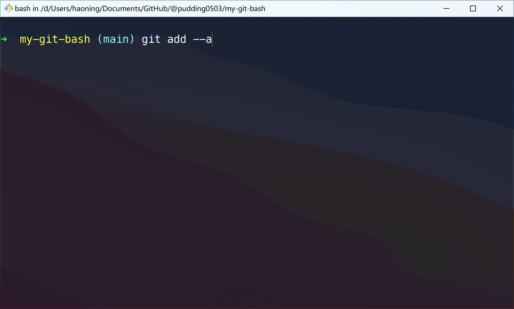
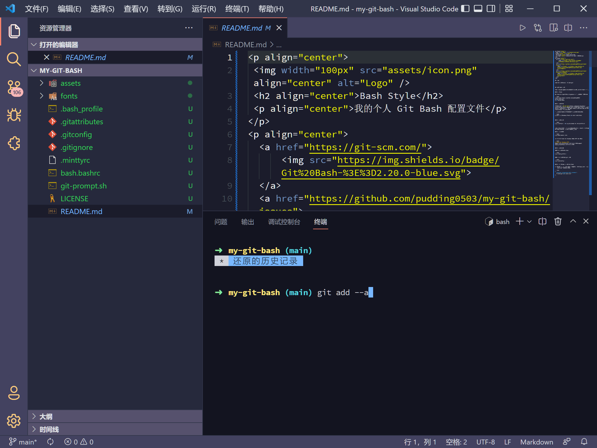

<p align="center">
 
 <h2 align="center">Bash Style</h2>
 <p align="center">我的个人 Git Bash 配置文件</p>
</p>
<p align="center">
  <a href="https://git-scm.com/">
      
  </a>
  <a href="https://github.com/pudding0503/my-git-bash/issues">
  	
  </a>
  <a href="https://github.com/pudding0503/my-git-bash/blob/main/LICENSE">
  	
  </a>
</p>


## 前提

我的 Git 安装目录在 `D:\dev\git`



## 安装 Bash 主题

以下所有命令都需要在以**管理员身份**运行的 Git Bash 中执行。

### 1. Clone

先 clone 此 repo，然后 cd 到目录中再执行下面的所有操作。

```bash
$ git clone https://github.com/pudding0503/my-git-bash.git
$ cd my-git-bash
```

### 2. 安装字体

字体采用的是 [Oh My Posh](https://ohmyposh.dev/docs/installation/fonts) 推荐的 Nerd 字体。 Nerd 字体是流行的字体，经过修补以包含图标。 推荐 **Meslo LGM NF**，但任何 Nerd 字体都应该与标准主题兼容。

执行命令后，将全部字体文件拖放进去即可完成安装。

```bash
$ start c://Windows//Fonts && start %cd%/fonts
```


### 3. 安装主题

```bash
$ cp .minttyrc ~ && cp git-prompt.sh /etc/profile.d
```


安装主题后同时会开启复制粘贴快捷键：Ctrl + Shift + C/V，需要 Git Bash 版本大于 2.20.0 才可以使用。

### 4. 环境变量

```bash
$ cp bash.bashrc /etc
```

其中，含有 Clash for Windows 代理 HTTP 的配置：

```bash
# Clash for Windows HTTP
export http_proxy=http://127.0.0.1:7890;export https_proxy=http://127.0.0.1:7890
```

### 5. 个人设置

#### 5.1 安装我的 alias

```bash
$ cp .bash_profile ~
```

####  5.2 安装我的 git 配置

```bash
$ cp .gitconfig ~
```

注意，这里的 [user] 信息是与 Github Desktop 登陆的账户一致（多 Github 用户请注意）：

```
[user]
	email = bitcookies@nousbuild.com
	name = bitcookies
```

### 6. 在 VSCode 中配置 Git Bash

在 VSCode 中使用 `Git Bash` 只需要在 `Settings.json` 中添加 `bash.exe` 的文件路径。

```json
{
  "terminal.integrated.shell.windows": "D:\\dev\git\\bin\\bash.exe"
}
```


